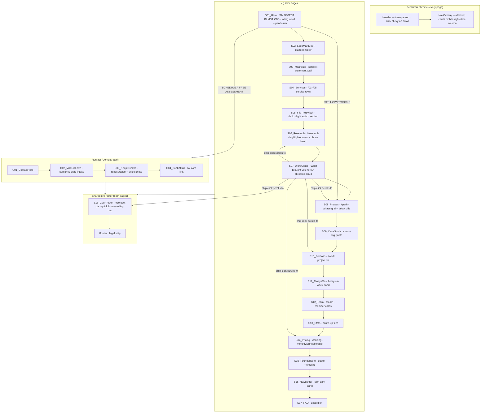

# ScaleMotion — Marketing Agency Site

A React + Vite + **Framer Motion** rebuild of the two-page structure you asked for
(home + contact), re-implemented from scratch and populated with the **Motion /
ScaleMotion** content from the redesign brief. Desktop **and** mobile layouts are
built in (breakpoints at 810px / 1200px, matching the reference).

```bash
npm install     # once
npm run dev     # local dev server (hot reload) → http://localhost:5173
npm run build   # production build → dist/
npm run preview # serve the production build locally
```

---

## Site diagram



## File tree

```
template_effica/
├── index.html                     # fonts (Sora / IBM Plex Mono / Geist), meta
├── package.json                   # react, react-router-dom, framer-motion, vite
├── vite.config.js
├── public/
│   └── scalemotion-logo.gif       # animated brand logo (header/footer/pricing)
├── docs/
│   └── COMPONENT-GUIDE.md         # per-component editing notes + animation map
└── src/
    ├── main.jsx                   # ReactDOM + BrowserRouter bootstrap
    ├── App.jsx                    # routes, scroll manager, grain overlay
    ├── content/
    │   └── siteContent.js         # ★ ALL site text lives here — edit copy here
    ├── styles/
    │   ├── tokens.css             # ★ brand colors, fonts, type scale
    │   └── global.css             # all component styles (searchable by label)
    ├── components/
    │   ├── layout/
    │   │   ├── Header.jsx         # fixed nav (transparent → dark sticky)
    │   │   ├── NavOverlay.jsx     # menu panel (desktop card / mobile column)
    │   │   ├── GetInTouch.jsx     # S18 shared pre-footer contact band
    │   │   └── Footer.jsx         # slim dark legal strip
    │   └── ui/
    │       ├── Reveal.jsx         # scroll-appear wrapper (slide-up + fade)
    │       ├── SectionTag.jsx     # "● 01 WHO WE ARE" labels
    │       ├── GridLines.jsx      # vertical hairlines + corner crosses
    │       ├── PillButton.jsx     # big rounded CTA, label rolls on hover
    │       ├── LineButton.jsx     # underlined CTA with sliding arrow
    │       ├── RollingLink.jsx    # per-letter roll-up hover links
    │       ├── Marquee.jsx        # infinite ticker
    │       └── Counter.jsx        # count-up stat numbers
    ├── pages/
    │   ├── HomePage.jsx           # section order for /
    │   └── ContactPage.jsx        # section order for /contact
    └── sections/
        ├── home/                  # S01_Hero.jsx … S17_FAQ.jsx (see diagram)
        └── contact/               # C01_ContactHero.jsx … C04_BookACall.jsx
```

## How to edit (Claude Code / VS Code)

| I want to change… | Edit this |
| --- | --- |
| Any text, headline, price, FAQ answer, nav link | `src/content/siteContent.js` (keyed by section label) |
| Brand colors / fonts / type sizes | `src/styles/tokens.css` |
| A section's layout or styling | `src/styles/global.css` — search for the label (e.g. `S05_FlipTheSwitch`) |
| A section's behavior/animation | `src/sections/home/<Label>.jsx` — every file has a header comment |
| Section order, hide a section | `src/pages/HomePage.jsx` / `ContactPage.jsx` — reorder/comment the lines |
| The logo | replace `public/scalemotion-logo.gif` (keep the filename) |
| Placeholder photos | search source for `imageNote` / `tc-photo` / `fn-photo` comments |

Every section renders with `data-component="S0X_Name"` on its root element, so in
browser DevTools you can inspect any part of the page and immediately know which
file to open.

## Animations implemented (Framer Motion)

- **Header**: transparent at top → dark translucent + blur on scroll (brief)
- **Mobile menu**: full-height column sliding right→left; desktop: drop-down card; staggered links, letter-roll hovers
- **Hero**: clip-reveal headline, the word *MOTION* **drops with a spring bounce** into "stays in&nbsp;motion" (Newton easter egg, brief), swinging **pendulum ball** in the background (brief), staggered CTAs
- **Flip the Switch**: section auto-flips dark→light on scroll (or tap the switch) with bulb glow (brief)
- **Research rows**: orange **highlighter sweep** as rows cross the viewport (brief)
- **Word cloud**: floating chips sized by frequency, hover hooks, click-to-scroll (brief)
- **Everywhere**: scroll reveals, count-up stats, marquee, delay pills sliding in with popped stat bubbles, scroll-linked "lighting up" quote walls, FAQ accordion, pricing toggle with crossfading prices, pill/link hover rolls

## Wiring forms

All three forms (mad-lib intake, quick contact, newsletter) currently do a
`mailto:` compose or local success state — swap the `onSubmit` handlers for your
CRM/webhook endpoint (search `onSubmit` in `C02_MadLibForm.jsx`,
`GetInTouch.jsx`, `S16_Newsletter.jsx`).
